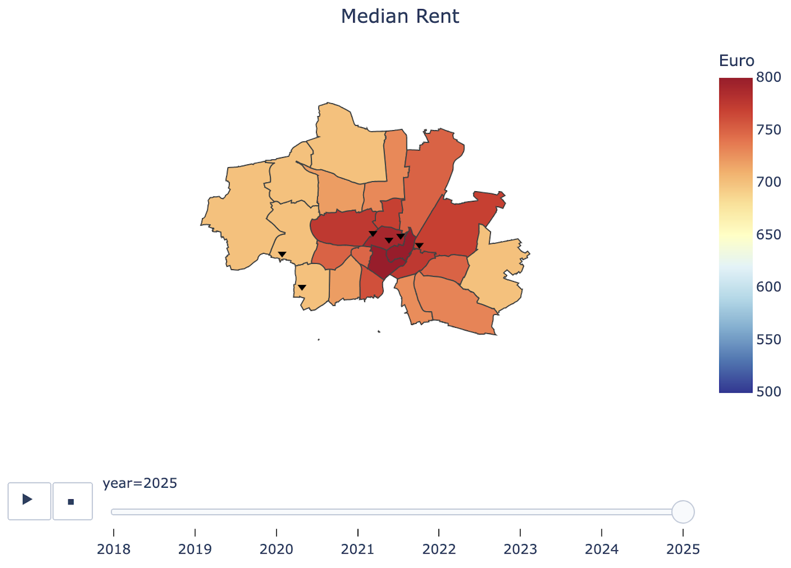

# Shared Housing & Demographics in Munich  

This project analyzes shared housing rent trends (2018–2025) and demographic shifts (2014–2023) in Munich. It was done for a master's-level course on data scraping and focuses on visualizing these trends over time using interactive maps. The goal is to explore patterns in the data using choropleth maps.  

I added a Python script that generates the maps, like the example seen below. All the information can be found on the project’s <a href="https://d-nader.github.io/munich-shared-housing/" target="_blank">website</a>.  

